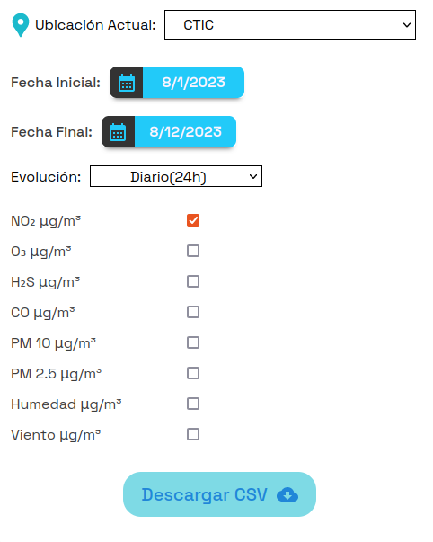

# Documentación Proyecto Smart Campus

# Proyecto Calidad de Aire

- **Descripción**

Este proyecto consta de medir el nivel de polución que hay en el aire dentro y fuera de las instalaciones de la Universidad Nacional de Ingeniería. Se tienen colocados sensores a lo largo de toda la UNI, estos están ubicado en la “Puerta 5”, en la “Puerta 3” y en el comedor central, estos sensores son sensores exteriores y su IP host es 181.176.1.0, también se tienen colocados sensores al interior del CTIC cuyo IP host es 192.168.1.0.

- **Implementación**

El código se encuentra en la siguiente ruta “src/pages/DetalleCA.js” y “src/pages/DetalleCAI.js”

Para diferenciar a los sensores estos tiene asociado un Id.

Interiores del CTIC: “ctic”
Puerta 5: “puerta 5”
Puerta 3: “puerta 3”

Para obtenerlos hacemos uso de la función obtenerNombre.

```jsx
function obtenerNombre(id) {
  if (id === "ctic") return "ctic";
  else if (id === "puerta 3") return "puerta 3";
  else if (id === "puerta 5") return "puerta 5";
}
```

El parámetro de entrada es el id que se obtuvo de obtenerNombre() y retorna el identificador que la API usara para poder mostrar la información de los sensores.

```jsx
function retornaidb(id) {
  let idb = "";
  if (id === "ctic") idb = "beegons:rak-3272s-e";
  else if (id === "puerta 3") idb = "beegons:rak-3272s-f";
  else if (id === "puerta 5") idb = "beegons:rak-3272s-h";
  return idb;
}
```

idb luego se concatenará con el host para así obtener la url del sensor.

Una de las funcionalidades de la web es poder descargar los datos de la calidad del aire registrado de los sensores.

Para ello, se implementa el function component DetalleCA()

Tiene como atributos las siguientes variables:

- searchParams: Almacenara una url.
- id: Almacena el id de la cadena de consulta de la url obenida.
- host: Almacena la IP host de los sesnores.

Una de las funcionalidades de este proyecto es el de poder capturar el estado de la calidad de aire en un cierto intervalo de tiempo.



Para ello se definieron los siguientes Hooks.

```jsx
const [opcion, setOpcion] = useState("PM2.5");
const [date1, setDate1] = useState(new Date());
const [date2, setDate2] = useState(new Date());
const [showCalendar1, setShowCalendar1] = useState(false);
const [showCalendar2, setShowCalendar2] = useState(false);
```

Nota: Recordar que en react, pata poder manipular variables y que estas se actualicen durante el renderizado de la pagina, es necesario usar los hooks.

Tipos de variables:

- opcion: String, termina el tipo de contaminante que se quiere medir.
- date1: Date, captura el dia inicial del intervalo de medicion.
- date2: Date, captura el dia final del intervalo de medicion.
- showCalendar1: boolean, permite visualizar un calendario.
- showCalendar2: boolean, permite visualizar un calendario.

Estos hooks son usados en las siguientes funciones

```jsx
const onChange1 = (date) => {
    setDate1(date);
    setShowCalendar1(!showCalendar1);
  };
  const onChange2 = (date) => {
    setDate2(date);
    setShowCalendar2(!showCalendar2);
  };

  const toggleCalendar1 = () => {
    setShowCalendar1(!showCalendar1);
  };
  const toggleCalendar2 = () => {
    setShowCalendar2(!showCalendar2);
  };
```

onChange1 y onChange2 son usados para escuchar cuando los botones son ejecutados, y actualizaran el estado de la fecha inicial y fecha final usando los hooks date1 y date2; a su vez, para poder visualizar el calendario se utilzan los hoooks showCalendar1 y showCalendar2.

toggleCalendar1 y toggleCalendar2 ocultan y permiten visualizar los calendarios de seleccion de fecha inicial y fecha final.

Implementación en el codigo HTML.

```html
<div
  className="container__detalle__descargar container__rango__fecha__descargar"
  style={{ fontWeight: "500" }}
>
  <div>Fecha Inicial: </div>
  <div>
    <button
      onClick={toggleCalendar1}
      className="container__btn__calendar"
    >
      <div>
        <CalendarMonthIcon />
      </div>
      <div>{date1.toLocaleDateString()}</div>
    </button>
    {showCalendar1 && (
      <Calendar onChange={onChange1} value={date1} />
    )}
  </div>
</div>

<div
  className="container__detalle__descargar container__rango__fecha__descargar"
  style={{ fontWeight: "500" }}
>
  <div>Fecha Final: </div>
  <div>
    <button
      onClick={toggleCalendar2}
      className="container__btn__calendar"
    >
      <div>
        <CalendarMonthIcon />
      </div>
      <div>{date2.toLocaleDateString()}</div>
    </button>
    {showCalendar2 && (
      <Calendar onChange={onChange2} value={date2} />
    )}
  </div>
</div>
```

Una funcionalidad de la pagina es el de poder descargar un CSV con los datos registrados del nivel de polucion del aire en un rango de fechas especificos, para poder implementar esta funcionalidad se requiere el uso de la API fetch para poder generar las solicitudes a la red que pertenecen los sensores.

```jsx
fetch(
      `${Getip(host)}/api/v1/calidad-de-aire/descargar/${retornaidb(
        id
      )}?maxDate=${Number(date2)}&minDate=${Number(date1)}&columns=0000${
        checkboxes.Humedad ? "1" : "0"
      }00000${checkboxes.PM10 ? "1" : "0"}00${checkboxes.PM25 ? "1" : "0"}${
        checkboxes.Viento ? "1" : "0"
      }00${checkboxes.CO ? "1" : "0"}${checkboxes.NO2 ? "1" : "0"}0${
        checkboxes.H2S ? "1" : "0"
      }${checkboxes.O3 ? "1" : "0"}0`
    )
      .then((response) => {
        if (response.ok) {
          return response.blob();
        } else {
          throw new Error("Error en la respuesta de la API");
        }
      })
      .then((blob) => {
        // Crea un enlace de descarga
        const downloadLink = document.createElement("a");
        downloadLink.href = URL.createObjectURL(blob);
        downloadLink.download = "archivo.csv";
        downloadLink.click();
      })
      .catch((error) => {
        console.error("Error al llamar a la API:", error);
      });
```

La url que recibe fetch esta formada de la siguiente manera:

- GetIP(host) obtenemos la ip del servidor de la red en la que pertenecen los sensores; por ejemplo, http://181.176.200:4000, luego se concatena los string “/api/v1/calidad-de-aire/descargar/” y el id del sensor con el cual nos estemos comunicando.
- Por utlimo, se realizan asserts para determinar que tipo de contaminante se esta solicitando

```jsx
...00000${checkboxes.PM10 ? "1" : "0"}00${checkboxes.PM25 ? "1" : "0"}${
        checkboxes.Viento ? "1" : "0"
      }00${checkboxes.CO ? "1" : "0"}${checkboxes.NO2 ? "1" : "0"}0${
        checkboxes.H2S ? "1" : "0"
      }${checkboxes.O3 ? "1" : "0"}0`
```

Con la funcion .then() nos aseguramos de que la solicitud sea exitosa, y convertimos los datos obtenidos de la solicitud en un objeto blob y se genera el enlace de descarga del archivo CSV.

En caso, la solicitud no sea exitosa lanzamos una exception.

Para poder realizar solicitudes a los sensores interiores (los que estan colocados en las instalasiones del CTIC) usaremos el siguiente array de datos.

```jsx
const data = [
			{idb: "1102", lugar: "Oficina de Administración"},
			{idb: "1201", lugar: "Laboratorio Smart City"},
			{idb: "1202", lugar: "Oficina de Calidad Universitaria"},
			{idb: "1203", lugar: "Oficina de Capacitaciones"},
			{idb: "1204", lugar: "Secretaria"},
]
```

Para hacer la solicitud a la API, se implemento un codigo similar al anterior.

```jsx
fetch(
      `${Getip(host)}/api/v1/carga-viral/descargar/${retornaidb(
        id
      )}?maxDate=${Number(date2)}&minDate=${Number(
        date1
      )}&columns=100000${c}${h}${t}11111`
    )
      .then((response) => {
        if (response.ok) {
          return response.blob();
        } else {
          throw new Error("Error en la respuesta de la API");
        }
      })
      .then((blob) => {
        // Crea un enlace de descarga
        const downloadLink = document.createElement("a");
        downloadLink.href = URL.createObjectURL(blob);
        downloadLink.download = "archivo.csv";
        downloadLink.click();
      })
      .catch((error) => {
        console.error("Error al llamar a la API:", error);
      });
  };
```

- la url que se obtiene esta conformada por la ip del servidor de la red de los sensores internos y la concatenacion de los string “/api/v1/carga-viral/descargar” y el idb del sensore que estemos solicitando. Asu vez, se le concatena la fecha inicial y la fecha final, el valor de las variables c, h y t, estas variables representan al CO2, humedad, y temperatura, respectivamente. Verifican el tipo de informacion que se esta solicitando.
- El resto del funcionamento de las funciones .Then() es exactamente igual que en el de los sensores exteriores.

# Proyecto Calidad de Agua

- **Descripción:** Se requiere poder determinar el estado de la calidad de agua en ciertas zonas de la Universidad Nacional de Ingenieria, para ello se requiere uso de uns interfaz que permita poder visualizar los datos como temperatura, PH y la turbidez del agua.
- **Implementación:**

El código se encuentra en la siguiente ruta “src/pages/CalidadAgua.js” 

FetchData captura los datos obtenido de la solicitud al servidor, luego esos datos son comvertidos a formato Json y son seteados al hook setDataActual.

La url se forma de la concatenacion de la ip del servidor y el string “/api/v1/calidad-de-agua?last=1&columns=00000111”.

```jsx
const fetchData = async () =>{
        const url = "http://localhost:3003/";
        const data = await fetch(`${Getip(host)}/api/v1/calidad-de-agua?last=1&columns=00000111`);
        const dataJson = await data.json();
        setDatactual({
            temperatura:{value:dataJson[0].temperatura},
            ph:{value:dataJson[0].ph},
            turbidez:{value:dataJson[0].turbidez},
        });
    }
```

Luego, habilitamos una conexion socket con la direccion ip del servidor y utilizamos la funcion fetchData para los datos iniciales desde la API. Luego, con socket.on() mandamos al socker a escuchar los datos solicitados con fetchData y seteamos la data. Por ultimo, cerramos el socket.

```jsx
useEffect(()=>{
        const socket = io(Getip(host), {
          transports: ["websocket"],
        });
        fetchData();
        socket.on("calidad_agua/calidad_agua:rak-3272s-o",async (data)=>{
                  
          setDatactual(data)
          
        });
        return () =>{
          socket.disconnect();
        };
      },[])
```

# Proyecto Smart Parking

- **Descripcion**: El proyecto consiste en poder brindar al usuario una plataforma en la que pueda visualizar los espacios libres en los estacionamientos de la Universidad Nacional de Ingenieria. Por el momento, solamente se tienen instalados los sonsres en el estacionamiento del CTIC.
- **Implementacion**:

El codigo se encuentra en la siguiente ruta: “src/pages/SmartParking/RealTimeComponentSmartParking.js”W

Para que el usario pueda visualizar la informacion de los estacionamientos, necesita poder ver la informacion en tiempo real. Para ello, usaremos sockets para obtener la informacion de los sensores en tiempo real.

```jsx
const socket = io(Getip(host), {
            transports: ["websocket"],
          });
          //fetchData();
          
          socket.on("smartparking_va/smartparking_va:ctic",async (data)=>{
            const controllerSP = new ControllerSmartParking(
                {
                    contenedor:contenedor,
                    src :"./SmartParking/SmartParkingCTICFrontis.png" ,
                    estado_inicial: data.estado.value
                }
            )       
            controllerSP.setArrayState(data.estado.value);
            console.log(data.estado.value)
            
          });
          return () =>{
            socket.disconnect();
          };
```

Habilitamos el socet y generamos la conexion con la IP del servidor, luego con la funcion socket.on() hacemos que el socket esuche las solicitudes. El socket recibe un objeto “data” el cual es usado para poder determinar el estado inicial de un estacionamiento.

Dentro de la funcion de callback se instancia el objeto controllerSP de la clase ControllerSmartPArking, y como atributo de estado_incial, le asignamos el valor del estado de la data. seteamos el objeto instanciado en el array de esttado. Inhabilitamos el socket.

# Proyecto Cuenta Personas

- **Descripcion**: Este proyecto consiste en implementar una intefaz de usuario que permita ver el aforo de un establecimiento en especifico, y capturar la hora de ingreso de las personas que ingresan a dicho establecimiento.
- **Implementacion**:

El proyecto se encuentra en la siguiente ruta “src/pages/CuentaPersonas/ControlAforo.js”

fetchInicial recolecta los datos obtenido de la solicitud al servidor.

Se construye la url concatenando la IP del servidor con el string “/api/v1/cuenta-personas/” y con el id del lugar (en este caso estamos seleccionando el id=”ctic”)

Los datos se formatean a formato JSON y son asignados a data. Luego en newData almacenamos los objetos que tengan los atributos timestamp y total_personas.

Por ultimo, seteamos en setDataPersonas con los objetos almacenados en newData.reverse() (la funcion reverse la utilizamos para que los datos más recientes esten al principio del array)

```jsx
const fetchInicial = async () =>{
        const urlDefault  = Getip(host) + `/api/v1/cuenta-personas/${id === "ctic" ? "ctic" : "smartcity" }?last=20&columns=001001`;
        const response = await fetch(urlDefault);
        const data = await response.json();
        const newData = data.map(d =>{
          const timestamp = new Date(d.time_index).getTime();
    
          return {timestamp:timestamp ,value: d.total_personas}
        });
        console.log(newData);
        setDataPersonas(newData.reverse());
      }
```

Para poder actualizar el numero de personas que van ingresando en un establecimiento usamos la funcion useEffect() para instanciar nuevos objetos (las nuevas personas que ingresan a un establecimiento).

Habilitamos el socket y la conexion al servidor, el socker recibe un objeto “data” el cual representa a los nuevos usuarios que ingresan.

Estos datos on obtenidos mediante una API.

Extraemos la hora de ingreso de data y actualizamos el numero total de personas (actualizamos el aforo a tiempo real) y al final seteamos en setDataActual() con los datos que se instanciaron.

```jsx
useEffect(()=>{
        fetchInicial();
        const socket = io(Getip(host),{
          transports: ["websocket"]
        })
        socket.on("CuentaPersonas/CuentaPersonas:ctic",  (data)=>{
          
          const str_time = data.TimeInstant.value;
          const timestamp = new Date(str_time).getTime();
          const personas = data.total_personas.value;
          console.log(timestamp,personas);
          const newTime = {
            timestamp:timestamp,value:personas
          }
    
          setDataActual(newTime);
          
        })
      },[]);
```

Esta funcion useEffect lo que hara es descartar las ultimas instancias despues de que el tamaño total del array sea mayor que 20 (esto con el fin de mejorar el rendimiento de la plataforma).

Verifica primero el estado de dataActual y declaramos un nuevo array contiene ell array de dataPersonas, agregando dataActual (la instancia creada en useEffect anterior) este nuevo Array se llama newPersonas.

Verificamos con un if() si es que el array tiene un tamaño mayor que 20 descartamos el primer dato del array.

Por ultimo, se setea en setDataPersonas() el array newPersonas.

```jsx
useEffect(()=>{
        if(dataActual){
          const newPersonas = [...dataPersonas,dataActual]
          if(newPersonas.length>20){
            newPersonas.shift();
          }
          setDataPersonas(newPersonas);
        }
      },[dataActual])
```

Al igual que en los otros proyectos requerimos el poder descargar un CSV de los datos de las personas que han ingresado en un rango de tiempo establecido.

El siguiente codigo se muestra la implementacion.

---

*El codigo de esta implementacion se encuentra en la ruta “src/pages/CuentaPersonas/PopupDescarga.js”*

---

Para poder implementar la descarga, utilizamos una API a la cual le solcitamos los datos al servidor.

Primero construimos la url de la misma forma que en url anteriores mencionada. Solamente implementamos un assert para poder seleccionar el establecimiento del cual queremos descargar los datos. 

Verificamos si es la solicitud fue aceptado, los datos de respuesta son formateados con la funcion blob()

Y con estos datos formateados generamos el link de descarga.

```jsx
const descargarDatos = () => {
        fetch(
            ip + `/api/v1/cuenta-personas/descargar/${id === "ctic" ? "ctic" : "smartcity" }?maxDate=${convertir(fecha2)}&minDate=${convertir(fecha1)}&columns=001001`
        )
          .then((response) => {
            if (response.ok) {
              return response.blob();
            } else {
              throw new Error("Error en la respuesta de la API");
            }
          })
          .then((blob) => {
            // Crea un enlace de descarga
            const downloadLink = document.createElement("a");
            downloadLink.href = URL.createObjectURL(blob);
            downloadLink.download = `historico${fecha1}_${fecha2}.csv`;
            downloadLink.click();
          })
          .catch((error) => {
            console.error("Error al llamar a la API:", error);
          });
      };
```
